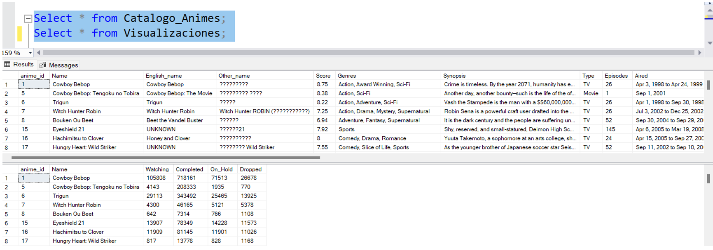

# Limpieza SQL
En este archivo pondre los Fragmentos de Codigo mas Significativos que e usaron para la limpieza de los Datos,
En el PDF Adjunto se encuentra la misma informacion pero mas detallada con mas imagenes.

Se importaron a SQL Managament Studio utilizando la herramienta de importación de SQL, por lo que muchas Columnas Incluyen valores NULL y/o se pasaron con algún formato de NVARCHAR o TEXT.

## Validacion Id's
```sql
-- Se cambio el Tipo de Dato de los ID’s para trabajarlos como INT.
ALTER TABLE Catalogo_Animes ALTER COLUMN ANIME_ID INT;
ALTER TABLE Visualizaciones ALTER COLUMN ANIME_ID INT;

-- Se valida que no haya ID's Repetidos en ambas Tabals.
WITH id_repetidos
     AS (SELECT anime_id,
                Count(anime_id) AS CANTIDAD
         FROM   catalogo_animes
         GROUP  BY anime_id)
SELECT *
FROM   id_repetidos
WHERE  cantidad > 1;

-- Validar si hay un ID repetido tabla Visualziacion
WITH id_repetidos
     AS (SELECT anime_id,
                Count(anime_id) AS CANTIDAD
         FROM   visualizaciones
         GROUP  BY anime_id)
SELECT *
FROM   id_repetidos
WHERE  cantidad > 1; 
```
Ciertas columnas que deberían tener datos Numéricos o de fecha para trabajarlos correctamente contienen la palabra UNKOWN, esto no permite que se puedan pasar al tipo de dato correcto, por lo que se cambiaron esos valores a 0.

Excepto la columna de SCORE, se le dio valor de 1 para que no afecte.

Las columnas con fecha DATE se pasaron como NULL.

La idea es trabajar en una tabla nueva compuesta por ciertas columnas de ambas tablas y sobre esa comenzar a limpiar la información.
Se valido el largo de algunas de las columnas que deben ir como VARCHAR para ponerles un valor adecuado al momento de crear la tabla.

## Creacion Tabla Nueva

```sql
--Validar Largo Columnas para cambiar a NVARCHAR
SELECT Max(Len(NAME))         NAME,
       Max(Len(english_name)) English_name,
       Max(Len(genres))       Genres,
       Max(Len(episodes))     Episodes,
       Max(Len(producers))    Producers,
       Max(Len(licensors))    Licensors,
       Max(Len(studios))      Studios,
       Max(Len(source))       Source,
       Max(Len(rating))       Rating,
       Max(Len(image_url))    image_url
FROM   catalogo_animes; 

Select * from Catalogo_Animes;

CREATE TABLE animes
  (
     anime_id      INT,
     NAME          VARCHAR(150),
     score         FLOAT,
     genero        NVARCHAR(100),
     type          NVARCHAR(20),
     episodes      INT,
     fecha_estreno NVARCHAR(50),
     temporada     NVARCHAR(50),
     status        NVARCHAR(20),
     producers     NVARCHAR(400),
     licensors     NVARCHAR(100),
     studio        NVARCHAR(150),
     source        NVARCHAR(200),
     duration      NVARCHAR(50),
     raiting       NVARCHAR(50),
     ranking       INT,
     popularity    INT,
     favorites     INT,
     scored_by     INT,
     members       INT,
     watching      INT,
     completed     INT,
     on_hold       INT,
     dropped       INT
  );

-- Insert Datos en la tabla Nueva
INSERT INTO animes
SELECT a.anime_id,
       a.NAME,
       Cast(score AS FLOAT),
       genres,
       type,
       episodes,
       aired,
       premiered,
       status,
       producers,
       licensors,
       studios,
       source,
       duration,
       rating,
       rank,
       popularity,
       favorites,
       scored_by,
       members,
       watching,
       completed,
       on_hold,
       dropped
FROM   catalogo_animes a
       LEFT JOIN visualizaciones b
              ON a.anime_id = b.anime_id; 

```
## Limpíeza Columnas
Se Valdiaron las Columnas con que ppudieran tener valores reprtidos o que se pudieran agrupar con esta consulta, se hizo el mismo proceso para todas,
unicamente cambiando la columna a revisar. 
Las columnas Type, Status y  Source estaban bien, no presentaban valores duplicados o que se pudieran Agrupar.


```sql
SELECT source,
       Count(DISTINCT source) cant
FROM   animes
GROUP  BY source
ORDER  BY 1; 
```

### Columna Duration
Se observa que hay valores que se pueden agrupar, ya que tienen la misma duración, pero algunos se les agrega la palabra “per episode”, se quitará esta palabra para agrupar más los valores.
Sobre el mismo query que utilice en el SELECT trabaje el UPDATE, unicamente cambiando la palabra y la condicion. 


```sql
-- Quitar la palabra 'per' y poder unificar mas la columna e Duracion
WITH duration
     AS (SELECT anime_id,
                NAME,
                duration,
                Substring(duration, 1, Charindex('per', duration) - 1) AS
                   Duracion_Correcta
         FROM   animes
         WHERE  duration LIKE '%per%')
SELECT *
FROM   duration;
--UPDATE duration set duration = Duracion_Correcta;

```


Con la columna DURATION quise crear una columna con el Tiempo en minutos en formato INT, y no en el formato de texto de “1 hora y 20 minutos” por ejemplo que se maneja en el archivo. 
Usando las Funciones CAST para transformar el Obtenido a Entero, TRIM para quitarle espacios que pudieran quedar, y SUBSTRING – CHARINDEX para obtener los valores separados.

Para las películas que tienen Horas, multiplique el valor que saque primero por 60 para que fueran minutos.
Los registros que únicamente tienen segundos se transforman y actualizan utilizando las mismas funciones, obteniendo el numero antes del Separados SEC y diviendo entre 60.

```SQL
/*Añadir una nueva columna para tener la duracion en Minutos y como Valor INT, quitando los Textos de Min y HR*/

--Añadir Columna a la Tabla
Alter Table Animes ADD T_Minutos INT;

/* Select y Update de las nuevas Columnas
SELECT y UPDATE para los valores que tienen el valor de Hora. Se separa el texto en Horas y Minutos, y se convierten a Enteros
*/
WITH t_minutos
     AS (SELECT anime_id,
                NAME,
                duration,
                Cast(Trim(Substring(duration, 1, 1)) AS INT) * 60
                   AS Horas,
                Cast(Trim(Substring(duration, Charindex('hr', duration) + 3, 2))
                     AS
                     INT)
                   AS
                Minutos,
                t_minutos
         FROM   animes
         WHERE  duration NOT IN ( '1 hr' )
                AND duration LIKE '%hr%')
--update t_minutos set t_minutos = horas + Minutos
SELECT *,
       horas + minutos AS Tiempo_Minutos
FROM   t_minutos; 

Select anime_id, name, duration,
cast(TRIM(SUBSTRING(duration,1,CHARINDEX('sec',duration)-1)) as float)/60 as Segundos
from Animes
where duration like '%sec%';

/*SELECT y UPDATE para el caso cuando la duracion sea de Segundos*/
WITH segundos
     AS (SELECT anime_id,
                NAME,
                duration,
                Cast(Trim(Substring(duration, 1, Charindex('sec', duration) - 1)
                     ) AS
                     FLOAT) / 60
                AS Segundos,
                t_minutos
         FROM   animes
         WHERE  duration LIKE '%sec%')
--UPDATE segundos SET    t_minutos = segundos; 
SELECT * FROM SEGUNDOS;

-- VALDIAR MINUTOS
Select anime_id, name, duration,
cast(TRIM(SUBSTRING(duration,1,CHARINDEX('Min',duration)-1)) as INT) as Minutos
from Animes
where duration like '%min%' and T_Minutos is null;

-- Update Valores
WITH minutos
     AS (SELECT anime_id,
                NAME,
                duration,
                Cast(Trim(Substring(duration, 1, Charindex('Min', duration) - 1)
                     ) AS
                     INT
                   ) AS
                Minutos,
                t_minutos
         FROM   animes
         WHERE  duration LIKE '%min%'
                AND t_minutos IS NULL)
SELECT *
FROM   minutos;
--UPDATE Minutos set T_Minutos = Minutos;
```
Resultado


### Columna FECHAS/FECHA_ESTRENO/FECHA_FIN.
Validación Columna Fechas, esta columna se va a separar en 2 partes, la primera columna será para la fecha de estreno, y esta misma columna se duplico para cuando el registro tenga fecha Final.
Para dejar únicamente la fecha de estreno se utilizó esta consulta extrayendo todo lo que se encuentre antes del delimitador “to” que indica que seguía otra fecha, con el UPDATE se actualizarán los valores para dejar lista la columna. Todo lo que no tuviera delimitador “to” se queda igual e indica que solamente hay una fecha en esa columna.


```sql
-- Creacion y llenado de la Columna
Alter Table Animes ADD Fecha_Fin NVARCHAR(30);
update animes set Fecha_Fin = Fecha_Estreno;

SELECT anime_id,
       NAME,
       fecha_estreno,
       Trim(Substring(fecha_estreno, 1, Charindex('TO', fecha_estreno) - 1)) AS
       Fecha_Inicio,
       Charindex('TO', fecha_estreno) - 1
FROM   animes
WHERE  fecha_estreno LIKE '% to %'; 

-- Update a la columna Fechas poniendo lo que esta antes del Delimitador 'to'
WITH fi
     AS (SELECT anime_id,
                NAME,
                fecha_estreno,
                Trim(Substring(fecha_estreno, 1, Charindex('TO', fecha_estreno)
                                                 - 1))
                AS
                Fecha_Inicio
         FROM   animes
         WHERE  fecha_estreno LIKE '% to %')
UPDATE fi
SET    fecha_estreno = fecha_inicio;

-- Columna FECHA FIN
-- Poner la fecha despues del delimitador 'to'
SELECT anime_id,
       NAME,
       fecha_fin,
       Trim(Substring(fecha_fin, Charindex('TO', fecha_fin) + 2, Len(fecha_fin))
       ) AS
       Fecha_Fin,
       Charindex('TO', fecha_fin) + 2
FROM   animes
WHERE  fecha_fin LIKE '% to %'; 

-- Update al campo Fecha Final poniendo la fecha que se encuentre despues del delimitador 'to'
WITH ff
     AS (SELECT anime_id,
                NAME,
                fecha_fin,
                Trim(Substring(fecha_fin, Charindex('TO', fecha_fin) + 2, Len(
                     fecha_fin)
                     )) AS
                Fecha_Final
         FROM   animes
         WHERE  fecha_fin LIKE '% to %')
UPDATE ff
SET    fecha_fin = fecha_final; 


```
Para los Que tienen fecha final con el carácter ‘?’ que significa que son animes aun en emisión, se pondrá el Valor NULL.

Revisando la columna Fecha_Estreno hay valores fechas que tienen diferente formato (YYYY, MMM-YY), o el valor “Not Aviable”
Cambios:
-  Formato YYYY: Se pondrá el 1 de Enero de su respectivo Año
-  Formato MMM-YY y MMM YYYY: Se pondrá el día 1 de su respectivo mes y año.
-   Valor “Not Aviable”: Pasaran a NULL.
 ```sql
-- Update a NULL a los valores '?'
UPDATE ANIMES SET FECHA_FIN = NULL WHERE Fecha_Fin ='?'

-- Se pone un Valor NULL a las fechas que tenian la leyenda Not Aviable
UPDATE ANIMES SET FECHA_FIN = NULL, Fecha_Estreno=null WHERE 
(Fecha_Fin ='Not available' or Fecha_Estreno = 'Not available')
```
Formato Fechas YYYY
```SQL
-- Validacion Fechas Formato YYYY
WITH largo
     AS (SELECT anime_id,
                NAME,
                fecha_estreno,
                fecha_fin,
                Len(fecha_estreno)          AS Largo_FI,
                Len(fecha_fin)              AS Largo_Ff,
                Concat('Jan 1,', fecha_fin) AS Fecha_Correcta
         FROM   animes
         WHERE  fecha_fin NOT LIKE '%,%')-- Se cambia la condicion dependiendo de la fecha que se quiera valdiar, Fin o Estreno
SELECT *
FROM   largo
WHERE  largo_ff = 4
       AND largo_ff IS NULL 
```


FORMATO FECHA MMM-YY
```sqL
Arma la fecha  correcta, compara los digitos del año (Ultimos 2), si son menores 25 se 
le concatena un 20 y el dia 01. Para formar por ejemplo MES 1, 2005
Contrario, se le concatena un 19 y el día 01. Para formar por ejemplo MES 1, 1999
En ambos casos se concatena el Mes que ya tienen.
*/
WITH largo
     AS (SELECT anime_id,
                NAME,
                fecha_estreno,
                fecha_fin,
                Len(fecha_estreno) AS Largo_FI,
                Len(fecha_fin)     AS Largo_Ff,
                CASE
                  WHEN Cast(RIGHT(fecha_fin, 2) AS INT) < 25 THEN
                  Concat(LEFT(fecha_fin, 3), ' 1, 20', RIGHT(fecha_fin, 2))
                  ELSE Concat(LEFT(fecha_fin, 3), ' 1, 19', RIGHT(fecha_fin, 2))
                END                AS FECHA_CORRECTA
         --CONCAT('Jan 1,',1) as Fecha_Correcta
         FROM   animes
         WHERE  fecha_fin NOT LIKE '%,%')
-- Se cambia la condicion dependiendo de la fecha que se quiera valdiar, Fin o Estreno
SELECT *
FROM   largo
WHERE  largo_ff = 18 -- Se cambia la condicion depedniendo si es FF o FI
```


```sqL
-- Formato Fecha MMM YYYY
WITH largo
     AS (SELECT anime_id,
                NAME,
                fecha_estreno,
                fecha_fin,
                Len(fecha_estreno AS Largo_FI,
                Len(fecha_fin) AS Largo_Ff,
                Concat(LEFT(fecha_estreno, 3), ' 1,', RIGHT(fecha_estreno, 4)) AS Fecha_Correcta
         FROM   animes
         WHERE  fecha_estreno NOT LIKE '%,%')
SELECT *
FROM   largo
WHERE  largo_fi = 8
       AND largo_ff IS NULL; 
```


```SQL
-- Validacion
Select ConverT(date,fecha_fin,101), cast(fecha_estreno as date) from animes

-- Cambiar el tipo de Dato de la Fecha a DATE
alter table animes alter column fecha_fin date;
alter table animes alter column fecha_estreno date;

```
### Columna Temporada.
Columna TEMPORADA
No presenta valores duplicados, o que se puedan agrupar, sin embargo, algunas filas se encuentran con valor UNKNOWN o de acuerdo con su fecha de estreno no corresponde con la estación que deberían.
Se actualizará desde 0 la columna.
```SQL
-- Validar a que mes pertenece cada Tempoarda
SELECT Month(fecha_estreno),
       Substring(temporada, 1, Charindex(' ', temporada)),
       Count(*)
FROM   animes
--WHERE TEMPORADA != 'UNKNOWN'
GROUP  BY Month(fecha_estreno),
          Substring(temporada, 1, Charindex(' ', temporada))
ORDER  BY 1;

-- Validar como quedaria la columna
SELECT anime_id,
       NAME,
       fecha_estreno,
       temporada,
       Month(fecha_estreno) AS Mes,
       Year(fecha_estreno)  AS Año,
       CASE
         WHEN Month(fecha_estreno) IN ( 12, 1, 2 ) THEN
             Concat('Winter ', Year(fecha_estreno))
         WHEN Month(fecha_estreno) IN ( 3, 4, 5 ) THEN
            Concat('Spring ', Year(fecha_estreno))
         WHEN Month(fecha_estreno) IN ( 6, 7, 8 ) THEN
            Concat('Summer ', Year(fecha_estreno))
         WHEN Month(fecha_estreno) IN ( 9, 10, 11 ) THEN
            Concat('Fall ', Year(fecha_estreno))
       END 
    AS Season
FROM   animes; 

-- Update Estaciones
UPDATE animes
SET    temporada = ( CASE
                       WHEN Month(fecha_estreno) IN ( 12, 1, 2 ) THEN
                       Concat('Winter ', Year(fecha_estreno))
                       WHEN Month(fecha_estreno) IN ( 3, 4, 5 ) THEN
                       Concat('Spring ', Year(fecha_estreno))
                       WHEN Month(fecha_estreno) IN ( 6, 7, 8 ) THEN
                       Concat('Summer ', Year(fecha_estreno))
                       WHEN Month(fecha_estreno) IN ( 9, 10, 11 ) THEN
                       Concat('Fall ', Year(fecha_estreno))
                     END ) 


```

