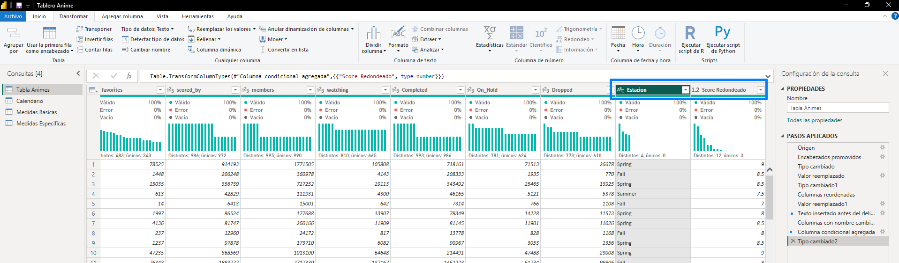
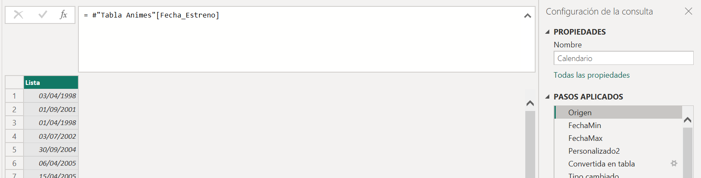
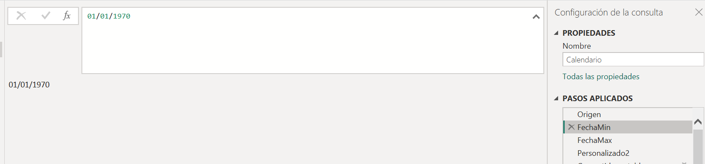
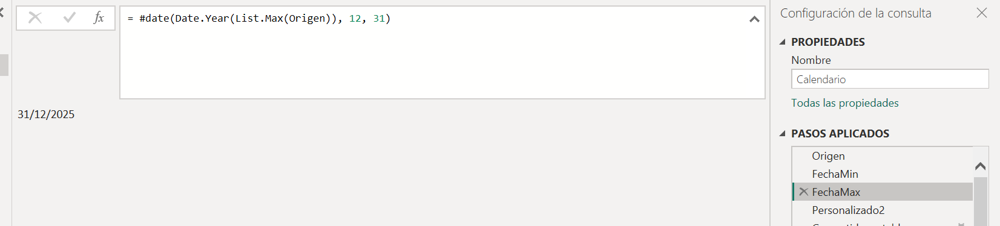
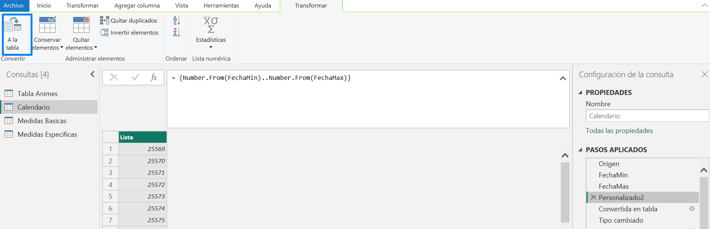
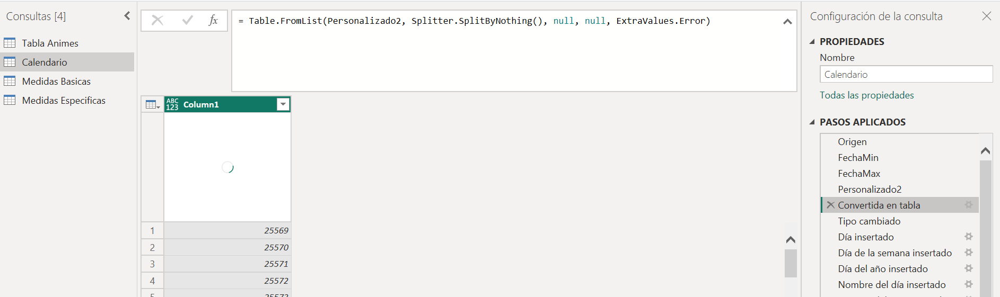
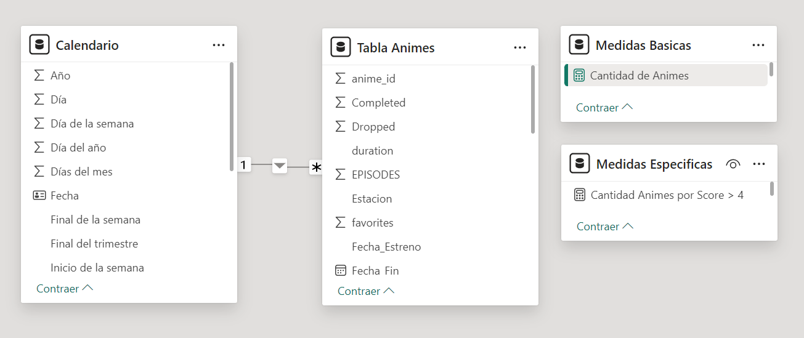
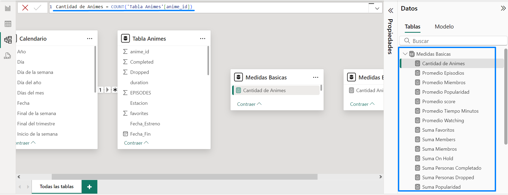
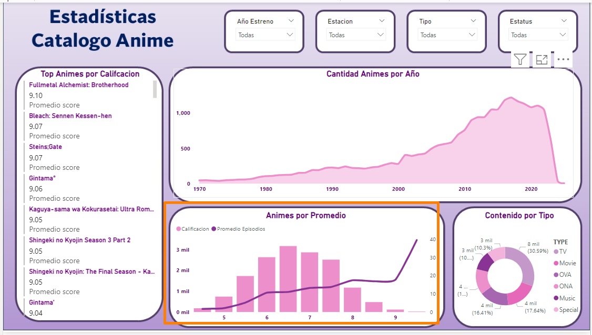
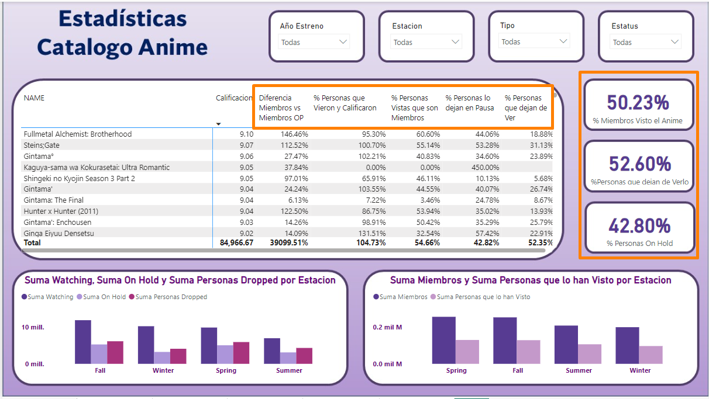

# Transformacion Datos

## Tabla Animes
Una vez limpios los datos en SQL, exporte los datos en un Archivo CSV.
Con Power Query se hicieron pocas modificaciones a la tabla
1.  Se cambiaron los tipos de dato de las Columnas fecha a DATE
2.  Se reemplazaron valores NULL de algunas Columnas.
3.  Se agregaron 2 columnas
   -  Estacion: Con la herramienta de Separara antes del delimitador saque la Temporada/Estacion sin el Año.
   -  Score_Redondead: Con una columna condicional se redondearon los valores de la Columna Score

```dax
= Table.AddColumn(#"Columnas con nombre cambiado", "Score Redondeado", each if [SCORE] > 9.5 then 10 
else if [SCORE] >= 9 then 9.5 else if [SCORE] >= 8.5 then 9 else if [SCORE] >= 8 then 8.5
else if [SCORE] >= 7.5 then 8 else if [SCORE] >= 7 then 7.5
else if [SCORE] >= 6.5 then 7 else if [SCORE] >= 6 then 6.5
else if [SCORE] >= 5.5 then 6 else if [SCORE] >= 5 then 5.5
else if [SCORE] >= 4.5 then 5 else if [SCORE] >= 4 then 4.5
else 0)
```

## Tabla Calendario
Se creo una tabla Calendario para poder trabajar con algunos datos de fechas, la tabla se creo utilizando lenguaje en codigo M.

```m
// Paso 1 Se toma de la Tabla Origen la columna sobre la que se calcularan las fechas.
= #"Tabla Animes"[Fecha_Estreno]
```


```m
// Paso 2: Se agrega un paso extra llamado Fecha Min con la fecha deseada.
// Nota: La tabla comienza desde el año 1920 pero de esa fecha hasta 1970 la informacion no es muy relevante,
//por lo que se decide omitir.
01/01/1970
```


```m
// Paso 3: Se agrega otro paso llamado FechaMax para tomar el Año Maximo que encuentre en la tabla Animes
//y la columna fecha extreno,y le agregara los valores 12 y 31 haciendo referencia al dia 31 de Dicembre
= #date(Date.Year(List.Max(Origen)), 12, 31)
```


```m
Paso 4: Se agrega otro paso y se crea una lista desde el valor de FechaMIN hasta FechaMAX
= {Number.From(FechaMin)..Number.From(FechaMax)}
```


Paso 6: Se da a la opcion de convertir Lista a Tabla.
Paso 7: Se cambia el Tipo de Dato
Paso 8: Se agregan columnas con la herramienta de Power Query.



## Relacionamiento
Se relaciona la tabla Calendario la columna Fecha con la Columna Fecha_Estreno.
Y 2 Tablas de Medidas que unicamente contendran las medidas Trabajadas.


## MEDIDAS
Se crean con Lenguaje DAX en una Tabla separada dedidcada a Medidas lo basico.
-  SUM de todas las cantidades
-  COUNT de Valores
-  AVG de Valores.

Otra tabla con medidas mas Especificas.
-  Cantidad Animes por Score > 4: La utilizo en el Grafico Animes por Promedio, utilizando la Columna Creada Score_Redondeado
para poder calcular **Cuantos Animes Hay por cada Segmento de Calificaion** tomando en cuenta los que tienen mas de 4 de Calificacion
```DAX
Cantidad Animes por Score > 4 =
CALCULATE (
    [Cantidad de Animes],
    FILTER ( 'Tabla Animes', [Score Redondeado] >= 4 )
)
```

-  Promedio Dias Finalizacion: La utilizo en una tarjeta, Indica en promedio, cuantos dias pasan desde que se estrena un Anime hasta que
Finaliza (Unicamente Animes)
```DAX
Promedio Dias Finalizacion =
CALCULATE (
    AVERAGEX (
        'Tabla Animes',
        DATEDIFF ( 'Tabla Animes'[Fecha_Estreno], 'Tabla Animes'[Fecha_Fin], DAY )
    ),
    'Tabla Animes'[TYPE] = "TV"
)
```

Estas Medidas las utilice en la Tabla y Tarjetas de la Pagina 4.
- Procentaje Miembros OP Respecto Otros: La utlice para sacar en porcentaje que tanta diferencia hay entre los Miembros de One Piece respecto otros Animes.
```DAX
Porcentaje Miembros OP Respecto Otros =
VAR T_Miembros = [Suma Members]
VAR OP_Miembros =
    CALCULATE (
        [Suma Members],
        FILTER ( ALL ( 'Tabla Animes' ), 'Tabla Animes'[NAME] = "One Piece" )
    )
VAR Porcentaje =
    DIVIDE ( T_Miembros, OP_Miembros, 0 )
RETURN
    Porcentaje
```
-  Suma Personas que lo han Visto: La utilice como Base para las siguientes medidas, solamente hace la suma de las columnas ON_HOLD, WATCHED, COMPLETED y DROPPED
Para sacar el total de personas que han visto el Anime.
```DAX
Suma Personas que lo han Visto =
SUMX (
    'Tabla Animes',
    'Tabla Animes'[On_Hold] + 'Tabla Animes'[Completed] + 'Tabla Animes'[watching] + 'Tabla Animes'[Dropped]
)
```
-  Porcentaje Personas  que lo vieron y calificaron: La utilice para saber en porcentaje, de todas las personas que vieron el Anime, cuantas de ellas en porcentaje dejaron
  una calificacion.

```DAX
Porcentaje Personas  que lo vieron y calificaron =
DIVIDE ( [Suma Personas que lo han Visto], [Suma Scored By], 0 )

```
-  Porcentaje Personas que lo ponen en Pausa: Indica de las Personas que lo estan viendo, cuantas lo han dejado en Pausa.
```DAX
Porcentaje Personas que lo ponen en Pausa =
DIVIDE ( [Suma On Hold], [Suma Watching], 0 )

```
- Porcentaje Vistas Que son Miembros: De todas las Visitas que tiene el Anime, indica cuantos de ellos son de parte de los Miembros.
```DAX
Porcentaje Personas Vistas que son Miembros =
DIVIDE ( [Suma Personas que lo han Visto], [Suma Members], 0 )

```
-  Procentaje Personas que dejan de Verlo: Indica de las Personas que lo estan viendo, cuantas lo han dejado de ver 
```DAX
Procentaje Personas que dejan de Verlo =
DIVIDE (
    CALCULATE (
        [Suma Personas Dropped],
        AND ( 'Tabla Animes'[Dropped] > 1, 'Tabla Animes'[Dropped] <> BLANK () )
    ),
    [Suma Watching],
    0
)
```

