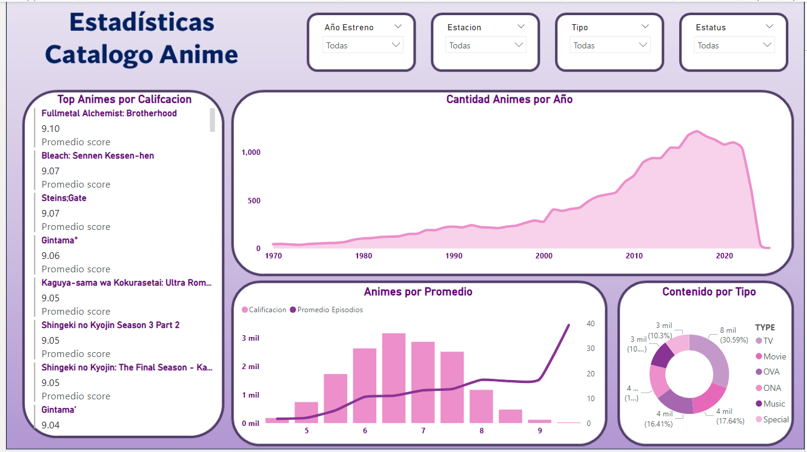
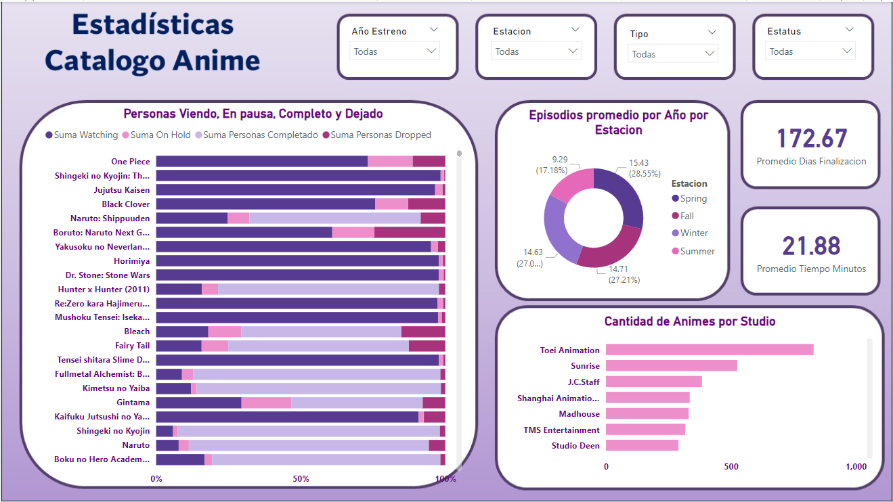

# Proyecto_Catalogo-Anime

# Introudccion
De acuerdo con los datos obtenidos se limpiara la informacion utlizando *SQL* agregando y modificando columnas para posterior pasar lo mas limpio posible los datos al software de Power BI.
Con los datos limpios, la intencion es crear un tablero interactivo que muestre datos generales de los Animes, como por ejemplo mostrar los que mejor Calificacion tienen, cuales tienen mas usuarios, cantidad de estreno por Temporada, etc.
El objetivo es poder ver indicadores sobre los Animes que estan mejor calificados.

# Links a Documentacion
  -  [Limpieza Datos SQL](https://github.com/joorge20/Proyecto_Catalogo-Anime/blob/main/1.%20Limpieza%20SQL.md)
  -  Creacion Tablero Power BI

# Conjunto de Datos
Se obtuvo el conjunto de Datos [Anime Dataset 2023](https://www.kaggle.com/datasets/dbdmobile/myanimelist-dataset) de la Plataforma Kaggle sobre las calificaciones y visualizaciones de animes de la plataforma MyAnimeList.com hasta el año 2023. El conjunto de datos incluía varias tablas de Animes y Usuarios, para este proyecto utilizare: 
  - anime-dataset-2023.csv: Contiene información del Catálogo de Animes y sus datos generales.
  - anime-filtered.csv: Contiene la misma información, pero con columnas que ayudan a medir las visualizaciones del Anime como personas viéndolo, personas que lo dejaron, etc.

En un Excel se dejó únicamente la columna ID, nombre y las columnas Watching, Completed, On_Hold y Dropped del Archivo anime-filtered.csv, para posterior unirlos en SQL.
Se importaron a SQL Managament Studio utilizando la herramienta de importación de SQL, por lo que muchas Columnas Incluyen valores NULL y/o se pasaron con algún formato de NVARCHAR o TEXT.

## Descripcion Columnas.
Tabla Animes (anime-dataset-2023.csv)
  -  anime_id: ID único de cada Anime.
  -  Name: Nombre del Anime.
  -  English name: Nombre en Ingles del Anime.
  -  Other name: Nombre Nativo del Anime (Japones, Chino, Coreano).
  -  Score: Rating dado al Anime.
  -  Genres: Géneros a los que pertenece el Anime.
  -  Synopsis: Breve Descripción de la Historia
  -  Type: Tipo de Contenido (TV series, movie, OVA, etc.).
  -  Episodes: Cantidad de Episodios.
  -  Aired: Fechas de Emisión.
  -  Premiered: Estación del Año en que se estrenó.
  -  Status: Estatus del Anime. (Finished Airing, Currently Airing, etc.).
  -  Producers: Compañías productoras.
  -  Licensors: Plataformas / Empresas con la Licencia. (streaming platforms).
  -  Studios: Estudios de Animación que hicieron el Anime.
  -  Source: Fuente del Material Original (manga, light novel, original).
  -  Duration: Duración cada Episodio.
  -  Rating: Clasificación.
  -  Rank: Ranking Basado en Popularidad u otros Criterios.
  -  Popularity: Popularidad del Anime.
  -  Favorites: Número de Personas que lo marcaron como favorito.
  -  Scored By: Número de Personas que calificaron al Anime.
  -  Members: Número de Personas que lo añadieron a sus Listas.
  -  Image URL: URL a una Imagen.
 
Tabla Visualizaciones (anime-filtered.csv)
  - Anime_id: ID único del Anime.
  - Name: Nombre del Anime
  - WATCHING: Cantidad de personas que lo están viendo.
  - COMPLETED: Cantidad de personas que lo terminaron de Ver.
  - ON_HOLD: Cantidad de Personas que lo dejaron en Pausa.
  - DROPPED: Cantidad de personas que lo dejaron de Ver. 

